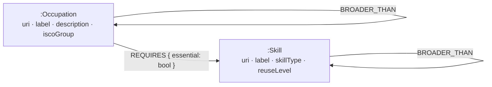

# Career & Reskilling Navigator — implementation plan

**Working name:** Compass
**Assignment:** Wexa AI take-home — build a graph database application on CognoDB
**Stack:** Next.js 16 (App Router, TypeScript) · `neo4j-driver` 5.x over Bolt · Tailwind · deployed as a long-running Node service on Render

---

## 1. The product

You tell it what you can do. It tells you:

1. what you can already be hired for,
2. what is one skill away, and
3. **which single skill unlocks the most doors**, and the cheapest multi-step route to a target career.

The user is a person considering a career change, not a developer.

### Worked example

**Priya, retail department manager, eight years in.**

She picks her current job rather than typing skills — the app prefills the nine essential
skills ESCO associates with it, and she edits them. Then:

- **Ready now** — shop supervisor, sales team leader, customer service supervisor.
- **One skill away** — store manager (missing: manage budgets, perform recruitment),
  inventory coordinator (missing: use warehouse management systems).
- **Bridge skills** — *learn `manage budgets` → unlocks 9 roles*, versus the merchandising
  course she was considering, which unlocks 1.
- **Career path** to supply chain manager: not the 14-skill leap, but
  `retail department manager → inventory coordinator → logistics analyst → supply chain manager`
  — three hops, seven skills, each hop a real job she can hold while learning the next set.
- **Gap rollup** — "78% of your gaps sit under *business administration*. You have one problem,
  not twelve."

> Every career site tells you which jobs match what you have.
> This tells you which single thing to learn next, and the cheapest route to where you're going.

---

## 2. Data

**Primary source: [ESCO](https://esco.ec.europa.eu) v1.2 CSV bundle** (European Commission).
~3,000 occupations, ~14,000 skills, ~130,000 occupation↔skill relations each tagged
*essential* or *optional*, plus hierarchies on both pillars. Downloaded once — no crawler,
no rate limits, no scraping.

Files needed (confirm exact names against the download, they shift between versions):
`occupations_en.csv`, `skills_en.csv`, `occupationSkillRelations_en.csv`,
`broaderRelationsOccPillar_en.csv`, `broaderRelationsSkillPillar_en.csv`.
Attribute per ESCO's reuse terms in the README.

**Fallback: O\*NET** (US Dept of Labor, free bulk download, no signup) if the ESCO download
flow blocks. Same shape, numeric importance ratings instead of an essential/optional flag.
**Decide this within the first 30 minutes, not on hour 20.**

### Source decision — 2026-08-13, ~20 minutes in

**The CSV bundle is not automatable, so ingest reads the public ESCO REST API instead.**
Neither the O\*NET fallback nor a manual download was needed.

The download page is a Drupal form chain — version → content → file type → language → *add to
package* → *export*. All of that drives fine from a script (package `v120_classification_en_csv`,
41.57 MB), and then it lands on a privacy statement that requires an **email address,
acceptance of the reuse terms, and a CAPTCHA**. That is a human step by design, and a setup
step no reviewer should have to repeat.

[`https://ec.europa.eu/esco/api`](https://ec.europa.eu/esco/api) is public, unauthenticated,
and carries the same content — verified against `retail department manager`: 17 essential and
22 optional skills, ISCO group, plus `hasSkillType`, `hasReuseLevel`, `broaderSkill` and
`broaderHierarchyConcept` on every skill. `reuseLevel` — the thing §2 called "worth grabbing"
— comes along for free.

The crawl is engineered rather than improvised: bounded concurrency, retry with backoff, and
an append-only NDJSON cache that makes an interrupted run resumable and a re-run free.
**`data/graph.json` is committed, so even that is a cost no reviewer pays.**

### The 20-minute stage that turned into 40 seconds

The obvious shape — fetch every occupation, then fetch every skill — is ~17,000 requests and
~30 minutes, and the second half is 12,000 of them just to learn skill *labels*.

The skill pillar's own hierarchy makes that unnecessary. Each of the ~650 theme concepts
(`S4.3.1 managing budgets or finances`) lists its member skills as `narrowerSkill` links, and
those links already carry the URI, the label and the skill type. **One request per theme names
all 13,000 skills** — and the same walk produces the skill→theme edges Q7 rolls gaps up
through, which the per-skill crawl would have produced anyway.

Coverage is 12,440 of 12,547 referenced skills. The 107 that no theme lists — skills ESCO
nests under other skills, plus the members of the one theme that answers HTTP 500 — are
fetched individually, so nothing is lost.

What the cheap path does *not* recover is per-skill `description` and `reuseLevel`. Both are
presentational: `reuseLevel` was flagged in §2 as "worth grabbing" because it lets the UI
explain why a bridge skill has leverage. `npm run ingest -- --skill-details` fetches them at
the original ~12,000-request cost; the snapshot records which mode produced it in
`meta.skillDetail`.

**Worth grabbing if present:** ESCO's `reuseLevel` on skills (transversal / cross-sector /
sector-specific / occupation-specific). It makes bridge-skill results markedly smarter and
lets the UI explain *why* a skill has leverage.

---

## 3. Data model



Roughly **17.5k nodes / 190k relationships** — comfortable inside the c0 tier's 1 GB.

### The key modeling decision

ESCO ships a *bipartite* graph: occupations connect to skills, never to each other. That is
navigable for one hop and useless for career paths. So at load time we derive
`ADJACENT_TO`: Jaccard similarity over essential-skill sets for every occupation pair,
keeping each occupation's **top 15 neighbours**.

- 3,000 occupations → 4.5M candidate pairs, computed in memory in TypeScript in ~2 seconds.
  **Do not** ask a 0.5 vCPU instance to do this in Cypher.
- Top-15 thresholding yields ~45k edges instead of millions.

This is the step that turns a lookup table into a navigable career network, and it is the
best thing to walk an interviewer through.

---

## 4. Queries

All in `lib/queries.ts`, every one parameterised — no string-concatenated Cypher anywhere.

**Design rule: never scan all occupations.** Always anchor on the user's skill set via an
indexed lookup and expand outward. That rule is what keeps this responsive on a burstable
half-core.

| # | Query | Role |
|---|---|---|
| Q0 | Skill typeahead — prefix on `Skill.label`, ranked by degree | input |
| Q1 | Occupation typeahead + its essential skills | "start from my current job" prefill |
| Q2 | **Ready now** — occupations whose essential skills are a subset of mine | results tier 1 |
| Q3 | **Within reach** — 2-hop: my skills → occupations → their *other* essential skills, ranked by gap size | **multi-hop**, results tier 2 |
| Q4 | **Bridge skills** — the hero | **the SQL-awkward one** |
| Q5 | **Career path** — shortest path over `ADJACENT_TO`, each hop annotated with skills to learn | path-as-answer |
| Q6 | Occupation detail — essential/optional split, marked have/missing, top neighbours | detail page |
| Q7 | Gap rollup — walk `BROADER_THAN` up the skill hierarchy to name gaps by theme | variable-depth traversal |

### Q4 — the query the whole app is built around

The elegant formulation: *occupations blocked by exactly one essential skill I lack, grouped
by the blocking skill.*

```cypher
MATCH (s:Skill)<-[:REQUIRES {essential: true}]-(o:Occupation)
WHERE s.uri IN $mySkills
WITH DISTINCT o
MATCH (o)-[:REQUIRES {essential: true}]->(req:Skill)
WITH o, collect(req.uri) AS required
WITH o, [x IN required WHERE NOT x IN $mySkills] AS missing
WHERE size(missing) = 1
WITH missing[0] AS blockingUri, collect(o) AS unlocked
MATCH (blocker:Skill {uri: blockingUri})
RETURN blocker.label            AS skill,
       size(unlocked)           AS unlocks,
       [x IN unlocked | x.label][0..5] AS examples
ORDER BY unlocks DESC
LIMIT 10
```

**Known edge case — document it rather than hide it:** anchoring on "occupations sharing ≥1
skill with me" misses an occupation whose *only* essential skill is one I lack. One-line fix:
union in occupations with a single essential requirement.

### Why a graph database (README section)

The occupation↔skill relation *alone* is a perfectly good join table, and the README should
say so honestly. What isn't:

- **Q5** — a derived similarity network traversed to a depth not known in advance, where the
  path is the deliverable, not a boolean.
- **Q4** — a hypothetical set-difference evaluated per candidate skill; in Postgres that's a
  correlated subquery over a self-join nobody wants to maintain.
- **Q7** — recursive hierarchy rollup.

The honest argument is stronger than pretending the base table is hard.

---

## 5. Application

**Entry — two doors,** because "list your skills" is intimidating:

1. *"Start from a job you've done"* — pick an occupation, it prefills that occupation's
   essential skills as editable chips. **This door is what makes the app usable by a
   non-technical person**, and it's cheap: Q1 already exists.
2. *"Pick your skills"* — typeahead multi-select.

**Results** — three tiers with real visual hierarchy: **Ready now** → **One skill away** →
**Bridge skills** as the hero card ("Learn *manage budgets* → unlocks 9 roles", roles named).

**Detail** — occupation page with a have/missing skill breakdown and a progress ring.

**Path** — `current → stepping stone → target` as a horizontal chain, skills to acquire
between each hop.

**States, built deliberately** (explicitly graded):
- skeletons shaped like the real content, not spinners
- empty state that says *why* ("pick at least two skills")
- "no matches" state that suggests broadening
- **database-unreachable panel, visually distinct from "no results"**, with a retry that
  pings `/api/health`

---

## 6. Engineering

- `lib/env.ts` — zod-validated `COGNODB_URI` / `COGNODB_USER` / `COGNODB_PASSWORD`.
  Validation is **lazy** so `next build` works on a machine with no `.env`.
- `lib/db.ts` — one module-scope driver cached on `globalThis` (survives dev hot reload),
  `maxConnectionPoolSize` 20, mapping driver errors to `DbUnreachableError` / `DbAuthError` /
  `DbQueryError`. Neo4j `Integer`s normalised to plain JS on the way out.
- `.env` gitignored from commit #1; `.env.example` committed (needs `!.env.example` since the
  Next.js default `.gitignore` ignores `.env*`).
- API error contract: **404** unknown occupation · **503** database unreachable · **500**
  everything else. The UI must distinguish "we don't have that" from "we can't reach the DB".
- `GET /api/health` → `verifyConnection()`, also Render's health check.
- Constraints on `Occupation.uri` / `Skill.uri`; label indexes for typeahead.
- Seed in batched `UNWIND` chunks of 500 in explicit write transactions. 256 MB will not
  survive 130k individual MERGEs.

### Phase 0 gate — the capability probe

CognoDB is openCypher, not Neo4j. `npm run probe` verifies against the live instance:
Bolt parameters, integer normalisation, constraints, property and TEXT indexes, `UNWIND`
batch MERGE, **relationship property maps in patterns**, **list comprehensions**, `all()`
predicates, `collect`/`size`/`DISTINCT`, **variable-length traversal**, **`shortestPath()`**,
a manual BFS path fallback, `CALL { }` subqueries, `STARTS WITH`, and APOC absence.

Q4 and Q5 both depend on constructs in that list. Finding a gap on hour 1 costs one query
rewrite; finding it on hour 30 costs the submission.

Non-critical failures and their fallbacks:
- `shortestPath()` unsupported → `MATCH p = (a)-[:ADJACENT_TO*1..4]->(b) RETURN p ORDER BY length(p) LIMIT 1`
- `CALL { }` unsupported → split into two round-trips, assemble in TypeScript
- TEXT index unsupported → plain property index + `STARTS WITH`
- constraints unsupported → plain indexes, rely on `MERGE` for idempotency

### Probe results — run against `db-739c35c2`, 2026-08-13

**15 passed · 1 failed · 1 informational. No critical gaps; the query plan stands as designed.**

Confirmed supported: Bolt parameters, integer normalisation, unique constraints, property
indexes, `UNWIND` batch MERGE, relationship properties, **relationship property maps in
patterns** (Q2/Q3/Q4/Q6), **list comprehensions** (Q3/Q4), `all()` predicates,
`collect`/`size`/`DISTINCT`, **variable-length traversal** (Q5/Q7), **`shortestPath()`**
(Q5), the manual BFS path fallback, `CALL { }` subqueries, `STARTS WITH`.

**One gap: `CREATE TEXT INDEX` is not supported** — `syntax error at position 7: expected (,
got IDENT ("TEXT")`. Non-critical. Q0/Q1 typeahead uses a **plain property index on
`Skill.label` / `Occupation.label` plus `STARTS WITH`**, both of which passed. At ~14k skills
that is comfortably fast; revisit only if typeahead feels sluggish under real data.

APOC is absent, as expected — the query plan uses none of it.

The instance is empty (0 nodes) and the probe cleaned up all its `:_Probe` fixtures.

---

## 7. Timeline — ~22.5h of work across 48h

| Phase | Work | Hours |
|---|---|---|
| 0 | Scaffold, CognoDB instance, driver, **capability probe** | 1.0 |
| 1 | ESCO parse → normalised `data/graph.json` | 2.0 |
| 2 | Schema, `ADJACENT_TO` precompute, batched seed | 2.5 |
| 3 | Query layer Q0–Q7, tuned against real data | 3.0 |
| 4 | API routes + error mapping | 2.0 |
| 5 | UI — entry, results, detail, path, all states | 7.0 |
| 6 | Deploy to Render | 2.0 |
| 7 | README, Mermaid diagram, screenshots, recording | 3.0 |

**Wall clock**

- **Day 1 morning (4h)** — Phases 0–1. *Checkpoint: `graph.json` exists, probe report is green.*
- **Day 1 afternoon (5.5h)** — Phases 2–3. *Checkpoint: Q4 returns sensible bridge skills from a
  real skill set, in the terminal.* **Make-or-break** — if the hero query isn't interesting by
  the end of day 1, the app has no story.
- **Day 1 evening (2h)** — Phase 4. API returns one complete payload.
- **Day 2 morning (5h)** — Phase 5: results + detail pages.
- **Day 2 afternoon (4h)** — Phase 5 finish (path view, states) + Phase 6 deploy.
  **Deploy with 6h to spare, not 1.**
- **Day 2 evening (3h)** — Phase 7.

**If behind, cut in this order:** Q7 gap rollup → optional-skill display → the path view (Q5)
→ dark mode.
**Never cut Q4** — it is the entire differentiator.
**Never cut the error/empty states** — explicitly graded, and they cost 45 minutes.

**Risks**
1. ESCO download friction → O\*NET fallback, decided in the first 30 minutes.
2. An openCypher gap in Q4/Q5 → the probe, plus the documented fallbacks above.
3. Seed time on c0 → 500-row batches; drop optional `REQUIRES` edges if needed.

---

## 8. Repository layout

```
career-compass/
├── app/
│   ├── page.tsx                      # entry: two doors
│   ├── results/page.tsx              # three result tiers + bridge skills
│   ├── occupation/[uri]/page.tsx     # detail + path
│   ├── api/
│   │   ├── health/route.ts           # ✅ Phase 0
│   │   ├── search/route.ts           # Q0 / Q1 typeahead
│   │   ├── analyze/route.ts          # Q2, Q3, Q4, Q7
│   │   └── path/route.ts             # Q5
│   └── globals.css
├── components/                       # SkillChips, BridgeCard, TierList,
│                                     # PathChain, EmptyState, ErrorPanel, Skeletons
├── lib/
│   ├── env.ts                        # ✅ zod-validated config
│   ├── db.ts                         # ✅ driver singleton + error mapping
│   ├── queries.ts                    # Phase 3 — all Cypher lives here
│   └── types.ts
├── scripts/
│   ├── probe.ts                      # ✅ openCypher capability probe
│   ├── ingest.ts                     # ESCO CSV → data/graph.json (+ ADJACENT_TO)
│   ├── schema.ts                     # constraints + indexes
│   └── seed.ts                       # batched UNWIND load
├── data/
│   ├── source/                       # raw ESCO CSVs (gitignored if large)
│   └── graph.json                    # committed snapshot — reviewers seed in 90s
├── .env.example                      # ✅
└── README.md
```

## 9. Phase 0 status — done

- [x] Next.js 16 + TypeScript + Tailwind scaffold, git initialised
- [x] `neo4j-driver` pinned to **5.x** deliberately: CognoDB advertises Bolt 5.0–5.4, and the
      5.x line is the best-documented driver against that range. v6 was installed first and
      rolled back rather than gamble on protocol negotiation two days before a deadline.
- [x] `.gitignore` fixed so `.env.example` is committed but `.env` never is
- [x] `lib/env.ts`, `lib/db.ts`, `scripts/probe.ts`, `app/api/health/route.ts`
- [x] `tsc --noEmit` clean · `eslint` clean · `next build` passes with no `.env` present
      (proving the lazy env validation), `/api/health` correctly emitted as dynamic
- [x] CognoDB c0 instance live, `.env` configured, **probe run: 15/17 pass, no critical gaps**
      (see §6 for the one TEXT-index gap and its fallback)
## 10. Phase 1 status — done

`npm run ingest` → `data/graph.json` (27.2 MB), built in **1m 12s** over 745 requests.

| | |
|---|---|
| Occupations | 2,909 |
| Skills | 13,201 |
| Skill themes | 656 |
| `REQUIRES` | 112,550 — 59,509 essential, 53,041 optional |
| `BROADER_THAN` | 1,210 occupation · 14,506 skill |
| Avg essential skills per occupation | 20.5 |

- [x] `scripts/esco-api.ts` — client: bounded concurrency, retry with jittered backoff,
      resumable NDJSON cache of *normalised* records (~5 MB; caching raw responses would be
      ~650 MB because ESCO returns all 28 languages of every label)
- [x] `scripts/ingest.ts` — ISCO tree → occupations → skill themes → stragglers → assemble
- [x] `lib/types.ts` — `GraphSnapshot`, the contract with Phase 2's seed
- [x] `tsc --noEmit` clean · `eslint` clean

**Verified against the worked example.** `retail department manager` (ISCO 1420.2) returns 17
essential skills including `manage budgets`, which 173 occupations require — the raw signal
Q4 is built on. The Q7 rollup chain resolves end to end:
`manage budgets → carry out work-related calculations → performing calculations (S2.6.1) →
calculating and estimating (S2.6) → information skills (S2) → skills (S)`.
Zero occupations missing a description, zero skills missing a label.

**Five resources ESCO will not serve** — four occupations and the theme `skill/S1.5.3`, all
permanent HTTP 500s (`More than one value found for field 'hasSkillType'`). Failures are
collected and reported rather than thrown, so one bad concept cannot cost a whole crawl.
Broken themes are rebuilt from their own code — `S1.5.3` sits under `S1.5` by definition, and
the parent lists the broken child with a proper label.

**Known gaps, deliberate:** `reuseLevel` is present for 1,171 of 13,201 skills and skill
descriptions likewise — the cost of the cheap skill path (see §2). Neither is load-bearing
for Q0–Q7; both are one `--skill-details` run away if the bridge-skill card wants them.

## 11. Phase 2 status — done

`npm run schema && npm run seed`. Every count in the database matches the snapshot, and a
full re-run leaves them identical — the load is idempotent.

| In CognoDB | |
|---|---|
| `:Occupation` | 2,909 |
| `:Skill` | 13,201 |
| `:SkillGroup` | 656 |
| `REQUIRES` | 112,550 (59,509 essential) |
| `BROADER_THAN` | 15,716 |
| `ADJACENT_TO` | 29,431 — **derived** |

Seed takes 6–7½ minutes (batch 2000 vs 500 is ~17% faster; the bottleneck is the server's
per-row `MATCH`+`MERGE`, not round trips, so 500 stays the default).

### `ADJACENT_TO`, and the threshold that decides who has a career path

Jaccard over essential-skill sets, top 15 neighbours, **0.22 seconds** in TypeScript for
2,909 occupations. It never visits the 4.2M candidate pairs: inverting the skill→occupations
index and accumulating shared counts only touches pairs that share at least one skill.

Stored **once per unordered pair and traversed undirected** — "nearest 15" is not symmetric,
so a directed edge would make paths depend on which end you start from. Verified that
CognoDB supports undirected `shortestPath` over a variable-length pattern.

The similarity floor turned out to be a product decision, not a tuning knob:

| floor | edges | occupations with no neighbour |
|---|---|---|
| 0.05 | 29,431 | 5 |
| 0.10 | 22,954 | 60 |
| 0.15 | 17,601 | 203 |

At 0.15 the graph looks tidier and 7% of occupations silently lose Q5 altogether. Kept at
**0.05**, with `jaccard` on every edge so the query layer ranks hop strength — a weak hop the
UI can label beats a missing edge it cannot explain.

Sanity check, nearest to `retail department manager`: drugstore manager, supermarket manager,
shop manager, shop supervisor, department store manager. The derivation works.

### Two findings that change Phase 3

**1. CognoDB ignores relationship property maps inside `OPTIONAL MATCH`.** Not a syntax
error — a silently wrong answer:

```
MATCH (o:Occupation {label: '…'})-[:REQUIRES {essential: true}]->(s)           →  17  ✓
MATCH (o:Occupation {label: '…'}) OPTIONAL MATCH (o)-[:REQUIRES {essential: true}]->(s) →  39  ✗
MATCH (o:Occupation {label: '…'}) OPTIONAL MATCH (o)-[r:REQUIRES]->(s) WHERE r.essential  →  17  ✓
```

39 is the total including optional relations — the filter is dropped. It cost a wrong
`essentialCount` on the first attempt. **Rule for `lib/queries.ts`: inside `OPTIONAL MATCH`,
filter relationship properties in `WHERE`, never in the pattern.** The Phase 0 probe tested
this construct under `MATCH`, where it works, which is exactly how it slipped through.

**2. `essentialCount` / `optionalCount` are denormalised onto `:Occupation`.** Deriving "how
far am I from this job" in Cypher means collecting every candidate's full skill list, which
trips CognoDB's **5-second BFS budget** (`MemoryPoolOutOfMemoryError: BFS budget exceeded`)
on Q4 outright. With the count on the node it becomes a subtraction, and Q4 drops from a
timeout to ~1.7s. The seed verifies the counts against the edges actually written.

### The hero query does not survive contact with the data

**Q4 as specified — "occupations blocked by exactly one essential skill I lack" — returns
empty on real ESCO data**, and not because of a bug.

For `retail department manager` (17 essential skills), the gap to every *other* occupation is
**at least 6**. Widening the input does not help: the union of three related retail roles is
33 skills, and the minimum gap is still 6. By coverage, one role sits at 90–100% (herself),
four at 30–49%, 498 below 30%. ESCO gives each occupation a distinctive essential set;
neighbours share ~8 of 17 skills and differ on the rest. Nothing is one skill away, for
anyone.

The plan's worked example assumed nine essential skills for that occupation and a two-skill
gap to store manager. Real ESCO has 17 and 6. **The example was hypothetical; the data
disagrees.**

What the data *does* support, measured and fast (1.9s):

> **Learn `maintain relationship with customers` → advances 56 of your 100 nearest roles**
> — drugstore manager, supermarket manager, kitchen and bathroom shop manager…

Same question, honest denominator: among the roles closest to you by coverage, which single
skill appears in the most gaps? Runners-up for Priya are `ensure customer focus` (53),
`recruit employees` (52), `maintain relationship with suppliers` (50). Named roles, real
leverage, no invented arithmetic.

**Recommended reframing for Phase 3** — unless overridden:

| Tier | Was | Becomes |
|---|---|---|
| 1 | Ready now — essential skills are a subset | **Closest roles** — ranked by coverage of their essential skills |
| 2 | One skill away | **Within reach** — coverage ≥ 50%, gap listed |
| 3 | Bridge skills — unlocks N roles outright | **Bridge skills** — advances N of your 100 nearest roles |

Q5 and Q7 are unaffected: the gap to `supply chain manager` is 16 named skills in 609ms, and
the theme rollup already resolves to the top of the hierarchy.

## 12. Phase 3 status — done

`npm run queries` — **16 checks against the live instance, all passing, 35s.** Every query in
`lib/queries.ts`, run on real data with real timings, and kept in the repo as the thing to run
when a query changes. It is not a unit test suite: no fixtures, no mocks. The scenario is
Priya, and her skills are read from the graph rather than hard-coded.

| | Query | Latency |
|---|---|---|
| Q0 | skill typeahead | 1.1s |
| Q1 | occupation typeahead · prefill | 0.9s |
| Q2 | closest roles | 2.8s |
| Q3 | within reach | 2.4s |
| Q4 | **bridge skills** | 4.2s |
| Q5 | career path — direct · bidirectional | 4.3s · 7.7s |
| Q6 | occupation detail | 0.9s |
| Q7 | gap rollup | 1.2s |

Baseline round trip to the c0 instance is ~0.85s, so read these as ~0.9s of latency plus work.

The reframing from §11 is what shipped. Q4 for Priya: *learn `maintain relationship with
customers` → advances **57 of your 100 nearest roles*** — drugstore manager, supermarket
manager, kitchen and bathroom shop manager. `completes` is reported alongside and is **0 for
every skill**, which keeps the plan's original question visible rather than quietly dropped.
Q3 returns empty for her — the nearest role is at 45% — and that is a real answer with its own
empty state, not a bug.

### Q5 did not survive contact either, twice over

**1. `shortestPath` is unusable past three hops.** Measured:

| pattern | result |
|---|---|
| `shortestPath(*1..3)` | ~0.95s ✓ |
| `shortestPath(*1..4)` | `BFS budget exceeded (5000 ms)` ✗ |
| `shortestPath(*1..6)` | 20s, or the same budget error ✗ |

Three hops reach **792 of 2,909** occupations, so two-thirds of pairs were unanswerable. There
is no GDS and no APOC to fall back on. What runs instead is the textbook answer to a blown BFS
budget: **search from both ends.** Two depth-3 neighbourhood queries — aggregated to
`min(length(p))` per node, which is what keeps them affordable at 1.8s each — intersected in
TypeScript to find the meeting point minimising `d(from,m) + d(m,to)`. Both sides being
complete to depth 3 makes the result the *true* shortest path up to distance 6, not an
approximation. Costs 4.3s direct, 7.7s via the fallback, against a query that otherwise
returns nothing at all.

**2. Shortest is not cheapest.** CognoDB's `shortestPath` behaves like `allShortestPaths` — it
returns every tied route, and returning all twelve costs the same 1.2s as returning one. Those
twelve routes to supply chain manager cost between **38 and 50 skills** to walk. `LIMIT 1`
picks among them arbitrarily. So every tied route is now scored by what it actually costs —
cumulative and deduplicated, since a skill learned for hop 1 is not paid for again at hop 3 —
and the cheapest wins, tie-broken on the largest single hop. The candidates were already on
the wire; only the choosing was missing.

**And the honest finding the plan's worked example got backwards:** the stepping stones are
*not* cheaper. Priya → supply chain manager is **16 skills as one leap, or 38 spread over three
holdable jobs.** The path's value is that she is employed at every step and no single hop
exceeds 19 skills — not that it saves work. §1 claimed "three hops, seven skills"; the data
says otherwise, and the UI should say what the data says.

### Two more things the data decided

**Q7 cannot group by code prefix.** `S2.6.1 → S2` works across the skills pillar and not at all
across the *knowledge* pillar, which hangs off ISCED-F fields carrying no code:
`work skills → business and administration → business, administration and law → knowledge`.
The level is chosen **relative to the pillar root** instead, which is nameable on both sides and
stable for skills nested at different depths. A skill with two parents is assigned to exactly
one theme so the shares sum to 100%. Priya's 52 gaps: 29% *communication, collaboration and
creativity*, 12% *assisting and caring*, 10% *business, administration and law*.

**Typeahead needed a second sort key.** Ranking occupations by size alone put *betting manager*
above every real shop role for the query "shop", because its synonym list contains "shop
manager". Direct label matches now sort ahead of synonym matches in both Q0 and Q1.

**A third openCypher gap, on top of §6's TEXT index:** `ORDER BY` only attaches to a
projection, so `WITH … WHERE … ORDER BY …` is a syntax error where Neo4j accepts it. A filtered
projection has to be re-projected before it can be ranked. Caught by `npm run queries` on the
first run.

- [x] `lib/queries.ts` — Q0–Q7, every value parameterised, no concatenated Cypher
- [x] `lib/types.ts` — result types, the contract with Phase 4
- [x] `scripts/queries.ts` — the live check harness, `npm run queries`
- [x] `tsc --noEmit` clean · `eslint` clean

## 13. Phase 4 status — done

`npm run dev` in one terminal, `npm run api` in another — **20 checks over real HTTP, all
passing.** Where `npm run queries` checks the Cypher, this checks what only the HTTP layer can
get wrong: status codes, the error contract, cache headers, and whether a database failure
leaks Cypher to the browser. It resolves the occupations it needs *through* `/api/search`
rather than hard-coding UUIDs, so it also proves the endpoints compose the way the UI will use
them. `BASE_URL=https://… npm run api` points it at the Phase 6 deployment.

| Route | Queries | Latency |
|---|---|---|
| `GET /api/health` | — | 12ms |
| `GET /api/search?q&kind` | Q0 · Q1 | 0.9–1.3s |
| `GET /api/occupation/[id]` | Q6 | 0.9–1.5s |
| `GET /api/occupation/[id]/prefill` | Q1 | 1.6s |
| `POST /api/analyze` | Q2 · Q3 · Q4 · Q7 | **6.5–7.9s** |
| `POST /api/path` | Q5 | 4.0–4.4s |

`next build` still passes with **no `.env` present**, and all six API routes are emitted
dynamic — the lazy env validation from Phase 0 survives the new routes.

### Identifiers stop at the door

ESCO URIs are the graph's identity and `lib/queries.ts` speaks nothing else, but they do not
fit in a path segment without double-encoding and a results link carrying seventeen of them
runs to 1,000 characters. Every occupation and skill URI is the same prefix plus a UUID
(2,909 of 2,909 and 13,201 of 13,201), so `lib/esco.ts` accepts **either form** anywhere the
API takes an identifier. Responses keep the full `uri`, because it is the honest identifier and
it dereferences — paste one into a browser and ESCO serves the concept.

### Analyze is 7.5s, and concurrency does not fix it

Measured in sequence: ranking 3.1s, bridge skills 4.0s, rollup 1.5s — 8.6s. Overlapped as far
as the dependencies allow, the median is **7.5s**. That is nowhere near `max(3.1, 4.0) + 1.5`,
and the reason is the finding: **a 0.5 vCPU instance largely serialises the work regardless of
how many connections it is asked over.** Issuing the ranking and the bridge query together
saves ~1s, not 3; chaining the rollup onto the ranking so it overlaps the bridge query's tail
saves ~0.4s more. Concurrency buys ~15%, not a speedup.

Two faster designs were measured and **rejected**:

| Design | Result | Why not |
|---|---|---|
| Fold the bridge pool count into the main query with `CALL { }` | — | CognoDB does not scope subquery variables outward: `variable "pool" not defined` |
| Rank 100 roles once, expand Q4 from that list | 2.1s vs 4.4s for Q4 | Forces `rankRoles` to a 100-role, **284 KB** payload to display 24. Each query currently fetches exactly what it needs |

The second is genuinely tempting and the numbers are real — it also makes the hero card's
denominator exact rather than clamped. It was rejected because it trades a 15% latency win for
fetching four times the data the page renders, and because Q4 stops being a self-contained
graph query. **Phase 5 must design for seven seconds** — skeletons shaped like the real
content, and one complete answer rather than a page that rearranges itself.

### The contract, verified against a dead database

Pointing `COGNODB_URI` at a closed port and re-running every route: **503 `db_unreachable`
everywhere, no Cypher on the wire.** Precedence is right too — a well-formed but unknown
occupation id returns 503 rather than a false 404, because with the database down we cannot
know it is unknown.

**One real bug, caught by that test.** With no `.env` at all, `/api/health` reported
*"Unexpected database error"* while every other route correctly said `misconfigured`. The
health route had an `EnvError` branch, but it was dead code: `verifyConnection` reaches
`getEnv()` from inside its `try`, so `classifyDbError` swallowed the `EnvError` and reclassified
it as a query failure. `classifyDbError` now passes it through. This mattered more than a
wrong string — `/api/health` is both the UI's retry target and the platform's health check,
and it was sending anyone debugging a misconfigured deploy to go and look at the database.

- [x] `lib/api.ts` — the error contract in one place; driver detail is logged, never returned
- [x] `lib/esco.ts` — URI ↔ short id, the only place the two forms meet
- [x] `app/api/{search,occupation/[id],occupation/[id]/prefill,analyze,path}/route.ts`
- [x] `scripts/api.ts` — the live HTTP check harness, `npm run api`
- [x] `lib/db.ts` — `EnvError` no longer misreported as a database error
- [x] `tsc --noEmit` clean · `eslint` clean · `next build` clean with no `.env`

## 14. Phase 5 status — done

`npm run dev` in one terminal, `npm run pages` in another — **14 checks over real HTTP against a
production build, all passing.** Where `npm run api` checks the JSON contract, this checks what a
person actually looks at, and the three properties of it that are invisible in a screenshot:
that the shell streams before the answer, that the four empty/error states are distinguishable by
their words, and that no Cypher escapes into the HTML or the RSC payload. Assertions are made
against the *visible text* — script blocks stripped, tags removed — so restyling cannot break the
suite and a deleted sentence can.

| Page | Queries | First byte | Complete |
|---|---|---|---|
| `/` — two doors | — | 20ms | 106ms |
| `/?s=…` — editor rehydrated from a link | `skillRefs` | — | 1.9s |
| `/results` | Q2 · Q3 · Q4 · Q7 | **20ms** | 6.7s |
| `/occupation/[id]` | Q6 | — | 0.8s |
| `/occupation/[id]?from=…` | Q6 → Q5 streamed | 0.8s | 3.8s |

`next build` still passes with **no `.env` present**, and all four pages plus six API routes are
emitted dynamic.

### Seven seconds, designed for rather than hidden

`/results` puts its heading, skill count and skeleton on screen in **20ms** and streams the answer
in at 6.7s — **333× later**. That ratio is the check: a refactor that accidentally awaits
`analyse()` above the Suspense boundary turns the page into a seven-second white screen, and
`npm run pages` fails on it specifically.

One boundary, not four. The tiers, the hero and the rollup arrive together because they are one
thought; streaming them separately would rearrange the page three times over seven seconds, which
is worse than waiting. The detail page is the opposite case and gets **two** boundaries — Q6 at
0.9s renders the job immediately, Q5 at 4–8s streams the route in underneath — because there the
costs are an order of magnitude apart.

### The pages do not call this app's own API

Server Components call `lib/queries.ts` directly. Fetching `http://localhost:3000/api/analyze`
from a page would serialise a 284 KB payload through the loopback, pay a second round trip on a
half-core box, and make every page reconstruct the error contract from a status code it had just
finished encoding. Phase 4's routes are the app's *public* surface — exercised end to end by
`npm run api`, and what a client other than this UI would call. The UI is not such a client.
**The one exception is the typeahead**, which runs in a browser on every keystroke, so
`/api/search` earns its keep.

Two things keep that from becoming two divergent implementations:

- `analyse()` moved out of the route into `lib/analysis.ts`, so the page and the endpoint run the
  same orchestration — including the measured concurrency shape, which is not incidental.
- `classifyError` is exported from `lib/api.ts` and used by both, so a given failure reads
  identically whether it is reached as JSON or as HTML.

**Failures are returned as values, not thrown.** React replaces a Server Component error's message
with a digest in production, so throwing would degrade the plan's database-unreachable panel to
"something went wrong" *in the deployment that matters*. Verified against a closed port on a
production build: all three pages render the full outage panel server-side, 4/4 of its sentences
in the HTML, **no Cypher, no driver text, no connection string**.

### The state lives in the URL, which Phase 4 paid for

The skill set is the app's only state and three screens need it. It rides in `?s=` as bare ESCO
ids — 17 skills is ~630 characters, against ~1,600 as full URIs — so refresh, back, and a pasted
link all work. That is exactly the short-id decision from §13 being spent. `skillRefs()` is the
one query added in this phase: it turns a link's ids back into labelled chips so "edit your
skills" means edit rather than start again.

### `notFound()` is unusable here, measured both ways

An unknown occupation ought to answer 404. Against **Next 16.3.0** neither arrangement works:

| | status | body |
|---|---|---|
| `notFound()` with a sibling `loading.tsx` | 200 | the 404 copy never reaches the HTML — payload only |
| `notFound()` without one | 404 | **completely blank**: no layout, no content, nothing without JS |

A page that renders nothing is a worse failure than a wrong status, and §5 grades these states on
what the reader sees. So the page renders the panel itself, server-side, at 200 — and the
machine-readable 404 stays where it is actually consumed: `GET /api/occupation/<unknown>` still
answers 404, `npm run api` still checks it, and `npm run pages` now checks **both halves** so the
trade-off cannot rot silently. A malformed id answers in **12ms** without issuing a query at all.

### What the UI had to say out loud

The data contradicted §1 three times, and the screens say what the data says rather than what the
plan hoped:

- **The hero states its denominator.** *"Maintain relationship with customers — it moves you closer
  to 57 of the 100 roles you are nearest to."* "Unlocks 9 roles" would be unfalsifiable; naming the
  pool lets the reader disagree. `completes` is 0, and the card says so in a sentence rather than
  dropping the column.
- **Tier 2 is empty for Priya, and explains itself.** Her nearest role is 45%. The empty state names
  that number and says why nothing clears half — it is a correct answer with its own copy, not a
  warning.
- **Stepping stones are not a discount.** The path card says *3 steps, 38 skills, never more than 19
  at once* — matching §12 exactly — and frames the value as being employed at every step rather
  than as saving work.

### Two things that fell out of building it

**`DetailSkeleton` was written and never wired up** — caught by noticing the occupation page had no
`loading.tsx` despite a 0.9s query. It has one now.

**A typeahead effect that set state synchronously** was rejected by the React compiler lint. The
effect now only *schedules*; every state change happens in the timer or an event handler. Backspacing
below two characters clears the list from `onChange`, where it belongs.

- [x] `app/globals.css` — three semantic hues (`accent` · `have` · `gap`), light and dark
- [x] `app/layout.tsx` — shell, metadata, ESCO attribution
- [x] `app/page.tsx` + `components/SkillBuilder.tsx` · `Typeahead.tsx` — the two doors
- [x] `app/results/page.tsx` — hero, two tiers, gap rollup, streamed
- [x] `app/occupation/[id]/{page,loading}.tsx` — detail + path, two boundaries
- [x] `components/` — BridgeCard, RoleCard, PathChain, ThemeBars, CoverageRing, SkillPill,
      EmptyState, ErrorPanel, Skeletons
- [x] `lib/analysis.ts` · `lib/load.ts` · `lib/params.ts` · `lib/format.ts`
- [x] `lib/queries.ts` — `skillRefs()`; `lib/api.ts` — `classifyError` exported
- [x] `app/error.tsx` (Next 16 names the prop `retry`, not `reset`) · `app/not-found.tsx`
- [x] `scripts/pages.ts` — the live page harness, `npm run pages`
- [x] `tsc --noEmit` clean · `eslint` clean · `next build` clean with no `.env`
- [x] `npm run queries` 16/16 · `npm run api` 20/20 still passing after the refactor

## 15. Phase 6 status — the service is declared, the push is the last human step

`render.yaml` describes the whole deployment: one Node web service, `frankfurt` beside the
CognoDB instance, `npm ci --include=dev && npm run build`, `npm start`, and the two secrets
declared `sync: false` so they are prompted for at creation and never live in the repo. There
is no dashboard state to reproduce — the blueprint *is* the configuration, and it is
reviewable in the diff.

Verified locally in the shape Render will run it (production build, `PORT` from the
environment):

| | with `.env` | with **no** `.env` |
|---|---|---|
| binds | `*:10123` — all interfaces, which the platform requires | same |
| `/api/live` | `200 {"status":"ok"}` | **`200`** |
| `/api/health` | `200`, instance address | `500 misconfigured` |
| `/` | `200` in 16ms | `200` in 15ms |

`npm run typecheck` · `npm run lint` · `npm run build` all clean.

### The health check the platform gets is not the one the UI gets

Phase 0 planned `/api/health` as both. That is wrong, and the reason is worth stating: **a
failing platform health check makes Render restart the container.** Restarting a web server
cannot fix a CognoDB outage, so pointing Render at the database check converts a degraded app
— one that renders the outage panel Phase 5 spent its budget on — into a crash loop that
renders nothing.

So the platform gets **`/api/live`**: is this process answering HTTP. It imports nothing that
reads the environment, which is why it answers 200 on a deploy with no credentials at all —
precisely the state in which `/api/health`'s `misconfigured` message most needs to be
reachable. `npm run api` and `npm run pages` now preflight against it too, so "nothing is
listening" stops being reported for a deployment that is listening and merely misconfigured.

### Two smaller things Render's shape decided

**`npm ci` alone would fail the build.** Render sets `NODE_ENV=production`, under which `npm
ci` skips devDependencies — and `typescript`, `tailwindcss` and `@types/*` are all
build-time. `--include=dev` is in the build command for that reason, not as a habit.

**Node is pinned three ways** — `.node-version`, `engines`, and `NODE_VERSION` in the
blueprint — because the build machine, the runtime and a contributor's `nvm` read different
ones.

### The free tier's cost, stated rather than discovered

Free services sleep after 15 minutes idle and take ~50s to wake. Against a `/results` that
already takes 7.5s, **a reviewer following a cold link waits about a minute.** Kept on `free`
deliberately; `plan: starter` is a one-line change, and a scheduled ping of `/api/live` is
the other answer — that route costs the database nothing, which is what makes it safe to poll.

- [x] `render.yaml` — the service, the health check path, the secrets as prompts
- [x] `app/api/live/route.ts` — process liveness, independent of the database
- [x] `app/api/health/route.ts` — comment corrected: readiness, not liveness
- [x] `scripts/api.ts` — preflight moved to `/api/live`, plus a check of it (20 → 21)
- [x] `scripts/pages.ts` — preflight moved to `/api/live`
- [x] `.node-version` · `engines` · README **Deployment** section
- [x] `tsc --noEmit` clean · `eslint` clean · `next build` clean

- [ ] **Next action:** push to GitHub, then Render → New → Blueprint → this repo, and enter
      `COGNODB_URI` / `COGNODB_PASSWORD` when prompted. Acceptance is
      `BASE_URL=https://… npm run api` (21) and `npm run pages` (14) against the live URL.
      Then Phase 7 — README query walkthrough, screenshots, recording, and the hosted link.
