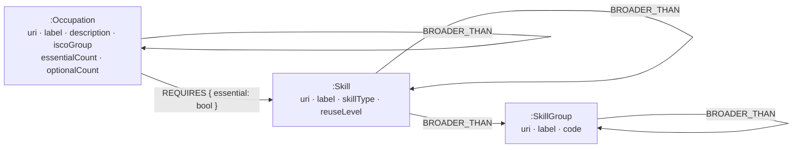
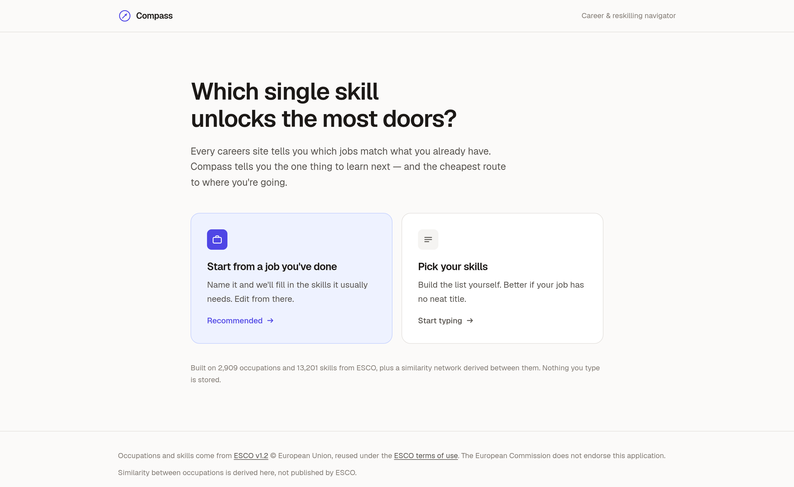
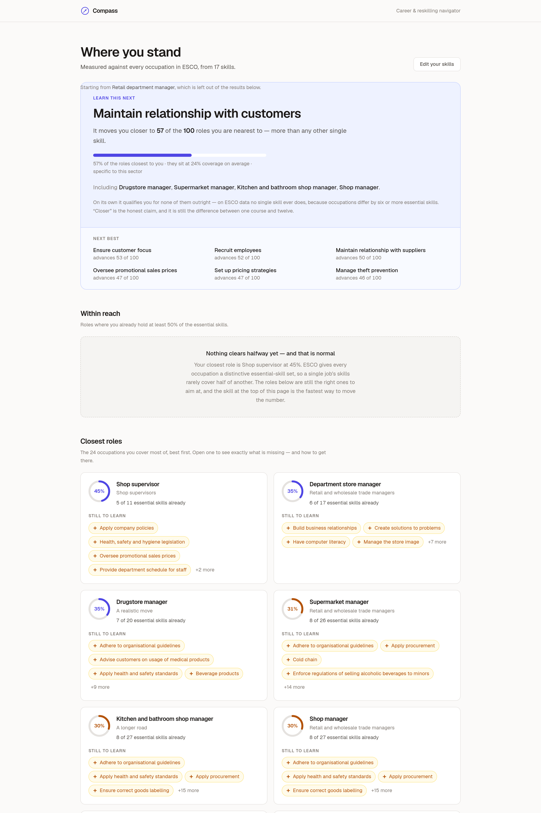
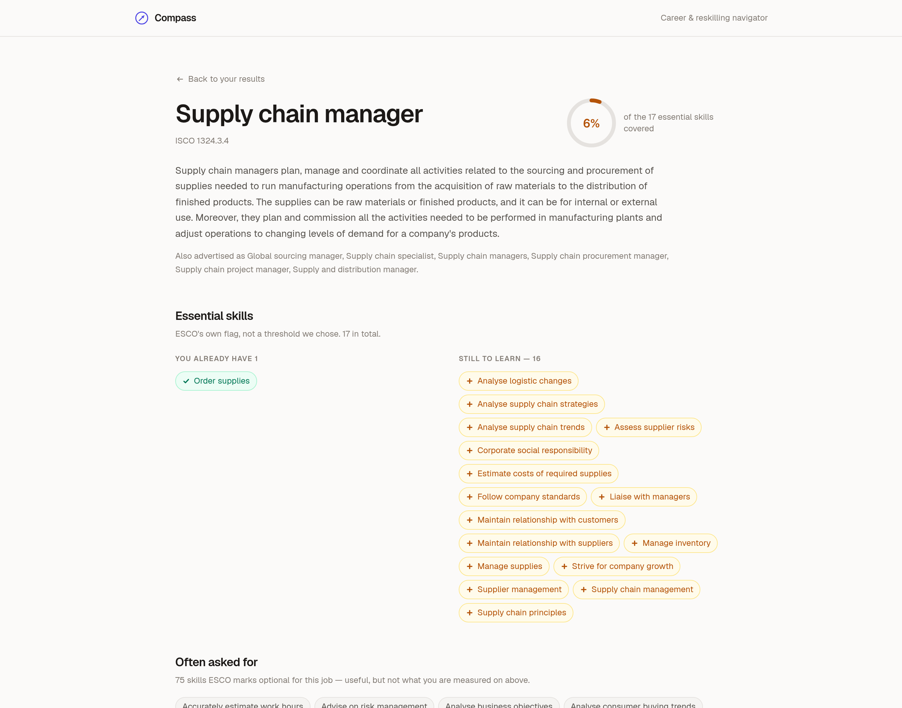

# Compass — Career & Reskilling Navigator

Tell it what you can do. It tells you which roles you're closest to, what stands between you
and each one, and **which single skill moves you toward the most of them** — plus the
cheapest multi-step route to a career you're aiming at.

Built on [CognoDB](https://console.cognodb.com), a managed graph database speaking
openCypher over Bolt, accessed with the official Neo4j driver.

> **Live at [career-compass-qrba.onrender.com](https://career-compass-qrba.onrender.com)** —
> Phase 6 done. Graph loaded, Q0–Q7 tuned against real data, API and UI checked over real
> HTTP both locally and against the deployment. See [PLAN.md](PLAN.md) for the plan and the
> findings that changed it.

---

## Why a graph database?

The occupation↔skill relation on its own is a perfectly good relational join table, and it
would be dishonest to claim otherwise. Half of these queries would be unremarkable SQL, and
saying so makes the other half easier to believe:

| Query | In Postgres |
|---|---|
| Q0 · Q1 typeahead | `LIKE 'x%'` on an index. Postgres does this better — trigram indexes exist, `CREATE TEXT INDEX` doesn't work here |
| Q2 · Q3 ranking | a join, a `GROUP BY`, a division. Genuinely no harder |
| Q6 detail | two joins. No harder |
| Q7 gap rollup | a recursive CTE. Wordier, not harder |
| **Q4 bridge skills** | a hypothetical set-difference evaluated per candidate skill — a correlated subquery over a self-join, and the thing nobody wants to maintain |
| **Q5 career path** | **the one that does not translate** |

**Q5 is the argument.** The route from one occupation to another is a traversal of a network
that does not exist in the source data, to a depth nobody knows in advance, where the *path
is the deliverable* rather than a boolean or a count. A recursive CTE can express reachability;
expressing "the shortest route, all of its ties, and the skills to acquire at each hop" turns
into a query you rewrite every time the question changes slightly. In Cypher it is
`shortestPath((a)-[:ADJACENT_TO*1..3]-(b))` and a list comprehension over `nodes(p)`.

Two honest caveats, because the argument is stronger with them than without:

- **`ADJACENT_TO` is derived in TypeScript, not in the database.** Jaccard over 2,909
  occupations takes 0.22s in a loop and would take minutes as Cypher on a 0.5 vCPU instance.
  The graph's value here is *storing and traversing* the derived network, not deriving it.
- **The free tier's limits shaped more of the query layer than the data model did** — a
  5-second BFS budget, no GDS, no APOC, and a `shortestPath` that dies past three hops. Q5's
  bidirectional search exists because of that, not because of anything about graphs.

## Data model



2,909 occupations · 13,201 skills · 656 themes · 112,550 `REQUIRES` · 29,431 `ADJACENT_TO`.

`ADJACENT_TO` is **derived at load time**, not present in the source data: ESCO connects
occupations to skills but never to each other. Jaccard similarity over essential-skill sets,
top 15 neighbours per occupation — 0.22s in TypeScript, because asking a 0.5 vCPU instance to
compare 4.2M pairs in Cypher is how you get a seed that never finishes. It is stored once per
unordered pair and traversed undirected, since "nearest 15" is not a symmetric relation.
That derivation is what makes career-path queries possible.

`essentialCount` and `optionalCount` are denormalised onto each occupation. Computing "how
far am I from this job" without them means collecting every candidate's full skill list,
which exceeds CognoDB's 5-second query budget; with them it is a subtraction.

## Data source

[ESCO](https://esco.ec.europa.eu) v1.2 (European Commission) — ~3,000 occupations,
~14,000 skills, ~130,000 occupation↔skill relations, each flagged *essential* or *optional*,
plus hierarchies on both pillars.

The data is read from the **public [ESCO REST API](https://ec.europa.eu/esco/api)** rather
than the CSV bundle: the bundle's download is gated behind a form requiring an email address,
acceptance of the reuse terms and a CAPTCHA, so it cannot be part of a reproducible setup
script. The API is unauthenticated and carries identical content.
[`scripts/ingest.ts`](scripts/ingest.ts) crawls it — ISCO tree → occupations → skills →
skill-hierarchy themes — and writes one normalised
[`data/graph.json`](lib/types.ts). That file is committed, so **nobody needs to run the crawl
to run the app**; `npm run seed` reads the snapshot.

---

## Setup

### 1. Create a CognoDB instance

1. Sign up at [console.cognodb.com/signup](https://console.cognodb.com/signup) — free tier,
   no credit card.
2. Create a free **c0** instance and pick a region. It provisions in under a minute.
3. Copy the connection URI (`bolt+s://<instance-id>.databases.cognodb.com`) and the
   generated password for the user `cognodb`. **The password is shown exactly once.**

### 2. Configure and verify

```bash
npm install
cp .env.example .env      # then fill in COGNODB_URI and COGNODB_PASSWORD
npm run probe             # verifies the connection and every Cypher construct the app uses
```

`npm run probe` writes a few throwaway `:_Probe` nodes, exercises each language feature the
query layer depends on, deletes them again, and prints a support matrix. It exits non-zero if
anything critical is missing. Run it before anything else.

### 3. Load the data

```bash
npm run schema    # constraints + indexes
npm run seed      # batched load of the committed data/graph.json into CognoDB
```

Seeding takes about six minutes. Re-crawling ESCO is optional and takes about one minute;
the committed snapshot in `data/graph.json` is what `seed` reads.

```bash
npm run ingest                       # full crawl: ~750 requests, ~1 minute, resumable
npm run ingest -- --limit 25         # a small slice, to see the pipeline work
npm run ingest -- --skill-details    # +12k requests: skill descriptions and reuse levels
npm run ingest -- --concurrency 4    # gentler on the ESCO API
```

The full crawl is ~750 requests rather than ~17,000 because skills are named from their
theme's member list — each of the ~650 hierarchy themes lists its skills with labels and
types, so one request per theme names all 13,000, and the same walk yields the skill→theme
edges the gap rollup traverses. The 107 skills no theme lists are fetched individually.
`--skill-details` adds a request per skill to fill in descriptions and `reuseLevel`;
`meta.skillDetail` in the snapshot records which mode produced it.

### 4. Run

```bash
npm run dev       # http://localhost:3000
```

`GET /api/health` reports live database connectivity.

---

## Scripts

| Command | What it does |
|---|---|
| `npm run dev` | Next.js dev server |
| `npm run build` / `npm start` | production build and server |
| `npm run probe` | **openCypher capability probe against the live instance** |
| `npm run ingest` | crawl the ESCO API into `data/graph.json` (resumable; the snapshot is committed) |
| `npm run schema` | create constraints and indexes |
| `npm run adjacency` | derive and inspect `ADJACENT_TO` without touching the database |
| `npm run seed` | batched load of `data/graph.json` (idempotent; `--wipe`, `--batch N`) |
| `npm run queries` | run Q0–Q7 against the live instance and print their timings |
| `npm run api` | exercise every API route over real HTTP (`BASE_URL=…` to aim it elsewhere) |
| `npm run pages` | exercise every page over real HTTP, including the empty and outage states |
| `npm run shots` | regenerate the README screenshots by driving the installed Chrome |
| `npm run typecheck` | `tsc --noEmit` |
| `npm run lint` | ESLint |

The last four need the app running (`npm run dev`, or a production `npm run build && npm start`)
and take `BASE_URL` — `BASE_URL=https://… npm run api` is how the deployment is checked.
`shots` additionally needs a Chrome or Chromium on the path; it drives it over the DevTools
protocol using Node's global `WebSocket`, so it adds no dependency to the project.

## Configuration

All connection details come from the environment; nothing is committed.
See [.env.example](.env.example).

| Variable | Required | Notes |
|---|---|---|
| `COGNODB_URI` | yes | `bolt+s://<instance-id>.databases.cognodb.com` |
| `COGNODB_USER` | yes | `cognodb` on the free tier |
| `COGNODB_PASSWORD` | yes | shown once at instance creation |
| `COGNODB_DATABASE` | no | defaults to the server's default database |
| `COGNODB_MAX_POOL_SIZE` | no | default 20; the c0 instance caps at 200 across all clients |

## Live

**https://career-compass-qrba.onrender.com** — `npm run api` 21/21 and `npm run pages` 14/14
against it, the same two suites that gate local.

On Render the app sits next to the CognoDB instance, and it shows: every single-query route
is 2–3× faster than from a laptop (occupation detail 1.5s → 0.47s, career path 4.4s → 2.8s).
`/api/analyze` is unchanged at ~8s, because it was never bound by round trips — see
[PLAN.md](PLAN.md) §13.

## Deployment

The app is a **long-running Node service**, not a serverless target: `lib/db.ts` keeps one
Bolt connection pool open across requests, and a platform that freezes the process between
invocations would re-handshake TLS on every page. [render.yaml](render.yaml) declares that
service, so the whole deploy is *New → Blueprint → point at this repo*.

1. Push this repository to GitHub.
2. Render → **New → Blueprint**, select the repo. It reads `render.yaml`.
3. It prompts for the two secrets marked `sync: false` — `COGNODB_URI` and
   `COGNODB_PASSWORD`. Nothing else needs setting; `COGNODB_USER` and the pool size are in
   the blueprint, and the database is already seeded (the instance is shared with local
   development — Render only reads it).
4. First build takes ~2 minutes. Then check the deployment the same way local was checked:

```bash
BASE_URL=https://<service>.onrender.com npm run api      # 21 checks
BASE_URL=https://<service>.onrender.com npm run pages    # 14 checks
```

Those two harnesses are the acceptance criteria for the deploy, and they already point
wherever you aim them — a deployment that passes both is doing everything local does.

### Two health checks, on purpose

| Route | Question | Consumer |
|---|---|---|
| `/api/live` | is this process answering HTTP? | Render's health check |
| `/api/health` | is CognoDB reachable from it? | the UI's "try again" button |

Pointing the platform at the database check looks tidier and is wrong. A failed health check
makes Render restart the container, and restarting a working web server cannot fix a database
outage — it only takes down the [outage panel](components/ErrorPanel.tsx) built to explain
one, and turns a degraded app into a crash loop. `/api/live` reads no environment variable at
all, so a deploy that is missing its credentials still starts and still serves the
`misconfigured` message where someone can read it.

### The free tier sleeps

Render's free plan spins the service down after 15 minutes without traffic and takes ~50
seconds to wake. On top of the 7.5s `/results` (see PLAN.md §13), a cold link is a
one-minute wait. `plan: starter` in [render.yaml](render.yaml) removes it; a scheduled ping
of `/api/live` is the other way, and `/api/live` is the right target for that too since it
costs the database nothing.

## Error handling

The driver's failure modes are classified into three cases that need three different
messages, in [lib/db.ts](lib/db.ts):

| Case | Meaning | API status |
|---|---|---|
| `DbUnreachableError` | DNS/TLS/timeout, or the instance is down | `503` |
| `DbAuthError` | credentials rejected | `500` |
| `DbQueryError` | connection fine, this statement failed | `500` |

The UI shows a dedicated "can't reach the database" panel — visually distinct from an empty
result — with a retry that re-pings `/api/health`.

## Queries

All eight live in [lib/queries.ts](lib/queries.ts), and three rules hold throughout:

1. **Everything is parameterised.** No user value is ever spliced into a query string.
2. **Never scan all occupations.** Every query anchors on an indexed lookup — a skill URI, an
   occupation URI, a label prefix — and expands outward. Ranking happens after a `LIMIT`.
3. **Filter relationship properties in `WHERE`, never in the pattern.** CognoDB silently
   *drops* a relationship property map written inside an `OPTIONAL MATCH`: `OPTIONAL MATCH
   (o)-[:REQUIRES {essential: true}]->(s)` returns essential **and** optional skills, with no
   error. It cost a wrong count before it was found.

Timings are from `npm run queries` against the c0 instance, whose baseline round trip is
~0.85s — read them as ~0.9s of latency plus work.

### Q0 · Q1 — typeahead · 1.1s · 0.9s

Prefix match plus synonyms, ranked by how many occupations require the skill.

```cypher
MATCH (s:Skill)
WHERE s.label STARTS WITH $q OR any(a IN s.altLabels WHERE toLower(a) STARTS WITH $q)
OPTIONAL MATCH (:Occupation)-[r:REQUIRES]->(s)
WHERE r.essential = true
WITH s, count(r) AS demand
RETURN s.uri AS uri, s.label AS label, demand
ORDER BY CASE WHEN s.label STARTS WITH $q THEN 0 ELSE 1 END, demand DESC, s.label
LIMIT $limit
```

`CREATE TEXT INDEX` is unsupported here, so this is a plain property index plus `STARTS WITH`
— which is why the query is lower-cased rather than the column (`toLower(s.label)` would drop
the index). The `CASE` is not decoration: ranking by demand alone put *betting manager* above
every real shop role for the query "shop", because its synonym list contains "shop manager".
Direct label matches sort ahead of synonym matches.

Q1 is the same shape over occupations, and its prefill — the chosen job's essential skills as
editable chips — is the door that makes the app usable by someone who would never volunteer a
list of skills.

### Q2 · Q3 — closest roles · within reach · 2.8s · 2.4s

The two-hop core: **my skills → occupations requiring them → those occupations' other
essential skills.**

```cypher
MATCH (s:Skill)<-[r:REQUIRES]-(o:Occupation)
WHERE s.uri IN $skills AND r.essential = true
WITH o, count(s) AS have
WHERE o.essentialCount > 0
WITH o, have, toFloat(have) / o.essentialCount AS coverage
WHERE coverage >= $minCoverage
WITH o, have, coverage                          -- re-projected so ORDER BY is legal
ORDER BY coverage DESC, have DESC, o.label
LIMIT $limit
OPTIONAL MATCH (o)-[r2:REQUIRES]->(m:Skill)     -- only for the survivors
WHERE r2.essential = true AND NOT m.uri IN $skills
...
```

Two things make this ~2s instead of a timeout. `have` comes from the traversal but `total` is
read off the node — `essentialCount`, denormalised at seed time — so coverage is a
subtraction rather than a second collection over every candidate's skill list. And the
expansion to the missing skills happens **after** the `LIMIT`, touching 24 occupations rather
than the ~1,500 that share at least one skill with a typical user.

Q3 is Q2 with `minCoverage: 0.5`. It is often empty, which is a real answer with its own
empty state — for the worked example the nearest role is at 45%.

### Q4 — bridge skills, the hero · 4.2s

**Among the roles you are closest to, which single skill appears in the most gaps?**

```cypher
MATCH (s:Skill)<-[r:REQUIRES]-(o:Occupation)
WHERE s.uri IN $skills AND r.essential = true
WITH o, count(s) AS have
WHERE o.essentialCount > have                   -- roles already covered unlock nothing
WITH o, have, toFloat(have) / o.essentialCount AS coverage
ORDER BY coverage DESC, o.label
LIMIT $pool                                     -- pool first, expand second
MATCH (o)-[r2:REQUIRES]->(m:Skill)
WHERE r2.essential = true AND NOT m.uri IN $skills
WITH m, o, coverage, o.essentialCount - have AS gap
ORDER BY coverage DESC, o.label
WITH m, count(o)                                  AS advances,
        sum(CASE WHEN gap = 1 THEN 1 ELSE 0 END)  AS completes,
        avg(coverage)                             AS meanCoverage,
        collect(o.label)[0..8]                    AS examples
RETURN m.uri AS uri, m.label AS label, advances, completes, meanCoverage, examples
ORDER BY advances DESC, meanCoverage DESC, m.label
LIMIT $limit
```

**This is not the query the plan called for, and the data is why.** The elegant formulation —
*occupations blocked by exactly one essential skill I lack* — returns empty on real ESCO data,
for everyone. ESCO gives each occupation a distinctive essential set; the minimum gap between
a role and its nearest neighbour is about six skills. Nothing is one skill away.

So the question is asked with an honest denominator instead, and the UI quotes it: *"learn
**maintain relationship with customers** → advances 57 of the 100 roles you are nearest to"*,
roles named. `completes` keeps the original question alive as a column — it is 0 on this data,
and saying so is better than hiding that we looked. The denominator is counted in a second
query rather than assumed, because for a narrow skill set fewer than 100 roles qualify and
"57 of your 100 nearest" would then be a lie.

`LIMIT $pool` before the second `MATCH` is not tuning. Expanding every candidate's skill list
trips CognoDB's 5-second BFS budget outright.

### Q5 — career path · 4.3s direct · 7.7s bidirectional

Shortest path over the derived `ADJACENT_TO` network, each hop a real job that can be held
while learning the next set of skills.

```cypher
MATCH (a:Occupation {uri: $from}), (b:Occupation {uri: $to})
MATCH p = shortestPath((a)-[:ADJACENT_TO*1..3]-(b))
RETURN [n IN nodes(p) | {uri: n.uri, label: n.label, essentialCount: n.essentialCount}] AS steps,
       [r IN relationships(p) | r.jaccard] AS jaccards
```

Undirected on purpose: `ADJACENT_TO` is written once per unordered pair, because "nearest 15"
is not a symmetric relation and a directed edge would make the answer depend on which end you
started from.

**Depth 3 is not a choice.** `*1..4` returns `BFS budget exceeded (5000 ms)`; `*1..6` takes
20s or fails the same way. Three hops reach 792 of 2,909 occupations, so two-thirds of pairs
were unanswerable, and there is no GDS or APOC to fall back on. What runs instead is the
textbook answer to a blown BFS budget — **search from both ends**:

```cypher
MATCH p = (a:Occupation {uri: $uri})-[:ADJACENT_TO*1..3]-(m:Occupation)
RETURN m.uri AS uri, min(length(p)) AS d
```

Two of those, one per endpoint, intersected in TypeScript to find the meeting point
minimising `d(from,m) + d(m,to)`, then both legs reconstructed with the depth-3 pattern that
does work. Aggregating to `min(length(p))` is what makes it affordable — 792 nodes in 1.8s,
where enumerating the paths themselves does not finish. Because both sides are complete to
depth 3, the result is the **true** shortest path up to distance 6, not an approximation.

**And shortest is not cheapest.** CognoDB's `shortestPath` behaves like `allShortestPaths`,
returning every tied route — twelve for the worked example, at the same 1.2s as returning one.
Those twelve cost between **38 and 50 skills** to walk, and `LIMIT 1` picks among them
arbitrarily. Each is scored by its cumulative deduplicated skill cost (a skill learned for hop
1 is not paid for again at hop 3) and the cheapest wins. The candidates were already on the
wire; only the choosing was missing.

### Q6 — occupation detail · 0.9s

One round trip for the essential/optional split with each skill marked have or missing, plus
the nearest occupations by derived similarity. Both `OPTIONAL MATCH` arms filter in `WHERE`
(rule 3), and both `collect`s are filtered for nulls — an `OPTIONAL MATCH` that finds nothing
still contributes one row of nulls, which would otherwise render as a phantom skill.

### Q7 — gap rollup · 1.2s

**Variable-depth traversal up the skill hierarchy**, so 95 missing skills become *"24% of your
gaps sit under communication, collaboration and creativity — you have one problem, not
twelve."*

```cypher
MATCH (s:Skill) WHERE s.uri IN $missing
MATCH path = (s)-[:BROADER_THAN*1..8]->(g:SkillGroup)
RETURN s.uri AS skill, g.uri AS theme, g.label AS label, g.code AS code,
       min(length(path)) AS depth
```

The obvious rule — group by code prefix, `S2.6.1` → `S2` — works on half the data and not the
other half. ESCO's *knowledge* pillar hangs off ISCED-F fields whose groups carry no code at
all (`work skills → business and administration → business, administration and law →
knowledge`). So the level is chosen **relative to the pillar root**: one below it, which is
nameable on both sides and stable for skills nested at different depths, where a fixed depth
is not. A skill reachable from two themes is assigned to exactly one, so the shares sum to
100% and the headline percentage means what it says.

## Screenshots

Taken from the deployment by `npm run shots`, which resolves its own scenario through the API
— so they cannot drift from the app the way a folder of hand-dragged PNGs does.

**The hero.** The claim names its own denominator, and says plainly what the skill does *not*
do, because on ESCO data no single skill qualifies you for anything outright.


**Two doors,** because "list your skills" stops most people at the first screen.



**The results page** — hero, then roles within reach, then closest roles. Tier 2 is empty for
this user and says why: her nearest role is at 45%, and nothing clearing half is the correct
answer, not a failure.



**A target job,** with every essential skill marked have or missing.



**The route there.** Three hops, 38 skills, never more than 19 at once — and the copy is
careful to say the path is *survivable*, not cheaper. The single leap costs 16 skills. The
data disagreed with the pitch, so the pitch changed.


## Demo

**https://career-compass-qrba.onrender.com**

<!-- TODO (Phase 7): screen recording. -->

## Attribution

This service uses the **ESCO classification** of the European Commission (European Skills,
Competences, Qualifications and Occupations), © European Union, 2026, retrieved from the
[ESCO REST API](https://ec.europa.eu/esco/api) and used under the
[ESCO terms of use](https://esco.ec.europa.eu/en/use-esco/download). ESCO is reproduced here
in a normalised form; it has been restructured, not edited — no occupation, skill or relation
has been added, removed or reworded. Neither the European Commission nor ESCO endorses this
application or is responsible for any conclusions it draws.
