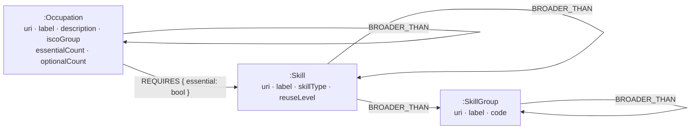

# Compass — Career & Reskilling Navigator

Tell it what you can do. It tells you which roles you're closest to, what stands between you
and each one, and **which single skill moves you toward the most of them** — plus the
cheapest multi-step route to a career you're aiming at.

Built on [CognoDB](https://console.cognodb.com), a managed graph database speaking
openCypher over Bolt, accessed with the official Neo4j driver.

> **Live at [career-compass-qrba.onrender.com](https://career-compass-qrba.onrender.com)** —
> Phase 6 done. Graph loaded, Q0–Q7 tuned against real data, API and UI checked over real
> HTTP both locally and against the deployment. See [PLAN.md](PLAN.md) for the plan and the
> findings that changed it. Remaining: Phase 7 — the query walkthrough, screenshots and a
> recording.

---

## Why a graph database?

<!-- TODO (Phase 7): expand with query timings and the Postgres comparison. -->

The occupation↔skill relation on its own is a perfectly good relational join table, and it
would be dishonest to claim otherwise. What a relational schema handles badly is everything
built on top of it:

- **Career paths** — a derived occupation-similarity network traversed to a depth not known
  in advance, where the *path itself* is the answer rather than a boolean.
- **Bridge skills** — a hypothetical set-difference evaluated per candidate skill
  ("if I learned X, how many occupations become reachable?"). In Postgres that's a correlated
  subquery over a self-join; in Cypher it's one pattern and an aggregation.
- **Gap themes** — recursive rollup through the ESCO skill hierarchy.

## Data model



2,909 occupations · 13,201 skills · 656 themes · 112,550 `REQUIRES` · 29,431 `ADJACENT_TO`.

`ADJACENT_TO` is **derived at load time**, not present in the source data: ESCO connects
occupations to skills but never to each other. Jaccard similarity over essential-skill sets,
top 15 neighbours per occupation — 0.22s in TypeScript, because asking a 0.5 vCPU instance to
compare 4.2M pairs in Cypher is how you get a seed that never finishes. It is stored once per
unordered pair and traversed undirected, since "nearest 15" is not a symmetric relation.
That derivation is what makes career-path queries possible.

`essentialCount` and `optionalCount` are denormalised onto each occupation. Computing "how
far am I from this job" without them means collecting every candidate's full skill list,
which exceeds CognoDB's 5-second query budget; with them it is a subtraction.

## Data source

[ESCO](https://esco.ec.europa.eu) v1.2 (European Commission) — ~3,000 occupations,
~14,000 skills, ~130,000 occupation↔skill relations, each flagged *essential* or *optional*,
plus hierarchies on both pillars.

The data is read from the **public [ESCO REST API](https://ec.europa.eu/esco/api)** rather
than the CSV bundle: the bundle's download is gated behind a form requiring an email address,
acceptance of the reuse terms and a CAPTCHA, so it cannot be part of a reproducible setup
script. The API is unauthenticated and carries identical content.
[`scripts/ingest.ts`](scripts/ingest.ts) crawls it — ISCO tree → occupations → skills →
skill-hierarchy themes — and writes one normalised
[`data/graph.json`](lib/types.ts). That file is committed, so **nobody needs to run the crawl
to run the app**; `npm run seed` reads the snapshot.

---

## Setup

### 1. Create a CognoDB instance

1. Sign up at [console.cognodb.com/signup](https://console.cognodb.com/signup) — free tier,
   no credit card.
2. Create a free **c0** instance and pick a region. It provisions in under a minute.
3. Copy the connection URI (`bolt+s://<instance-id>.databases.cognodb.com`) and the
   generated password for the user `cognodb`. **The password is shown exactly once.**

### 2. Configure and verify

```bash
npm install
cp .env.example .env      # then fill in COGNODB_URI and COGNODB_PASSWORD
npm run probe             # verifies the connection and every Cypher construct the app uses
```

`npm run probe` writes a few throwaway `:_Probe` nodes, exercises each language feature the
query layer depends on, deletes them again, and prints a support matrix. It exits non-zero if
anything critical is missing. Run it before anything else.

### 3. Load the data

```bash
npm run schema    # constraints + indexes
npm run seed      # batched load of the committed data/graph.json into CognoDB
```

Seeding takes about six minutes. Re-crawling ESCO is optional and takes about one minute;
the committed snapshot in `data/graph.json` is what `seed` reads.

```bash
npm run ingest                       # full crawl: ~750 requests, ~1 minute, resumable
npm run ingest -- --limit 25         # a small slice, to see the pipeline work
npm run ingest -- --skill-details    # +12k requests: skill descriptions and reuse levels
npm run ingest -- --concurrency 4    # gentler on the ESCO API
```

The full crawl is ~750 requests rather than ~17,000 because skills are named from their
theme's member list — each of the ~650 hierarchy themes lists its skills with labels and
types, so one request per theme names all 13,000, and the same walk yields the skill→theme
edges the gap rollup traverses. The 107 skills no theme lists are fetched individually.
`--skill-details` adds a request per skill to fill in descriptions and `reuseLevel`;
`meta.skillDetail` in the snapshot records which mode produced it.

### 4. Run

```bash
npm run dev       # http://localhost:3000
```

`GET /api/health` reports live database connectivity.

---

## Scripts

| Command | What it does |
|---|---|
| `npm run dev` | Next.js dev server |
| `npm run build` / `npm start` | production build and server |
| `npm run probe` | **openCypher capability probe against the live instance** |
| `npm run ingest` | crawl the ESCO API into `data/graph.json` (resumable; the snapshot is committed) |
| `npm run schema` | create constraints and indexes |
| `npm run adjacency` | derive and inspect `ADJACENT_TO` without touching the database |
| `npm run seed` | batched load of `data/graph.json` (idempotent; `--wipe`, `--batch N`) |
| `npm run queries` | run Q0–Q7 against the live instance and print their timings |
| `npm run api` | exercise every API route over real HTTP (`BASE_URL=…` to aim it elsewhere) |
| `npm run pages` | exercise every page over real HTTP, including the empty and outage states |
| `npm run typecheck` | `tsc --noEmit` |
| `npm run lint` | ESLint |

The last three need the app running (`npm run dev`, or a production `npm run build && npm start`)
and take `BASE_URL` — `BASE_URL=https://… npm run api` is how the deployment is checked.

## Configuration

All connection details come from the environment; nothing is committed.
See [.env.example](.env.example).

| Variable | Required | Notes |
|---|---|---|
| `COGNODB_URI` | yes | `bolt+s://<instance-id>.databases.cognodb.com` |
| `COGNODB_USER` | yes | `cognodb` on the free tier |
| `COGNODB_PASSWORD` | yes | shown once at instance creation |
| `COGNODB_DATABASE` | no | defaults to the server's default database |
| `COGNODB_MAX_POOL_SIZE` | no | default 20; the c0 instance caps at 200 across all clients |

## Live

**https://career-compass-qrba.onrender.com** — `npm run api` 21/21 and `npm run pages` 14/14
against it, the same two suites that gate local.

On Render the app sits next to the CognoDB instance, and it shows: every single-query route
is 2–3× faster than from a laptop (occupation detail 1.5s → 0.47s, career path 4.4s → 2.8s).
`/api/analyze` is unchanged at ~8s, because it was never bound by round trips — see
[PLAN.md](PLAN.md) §13.

## Deployment

The app is a **long-running Node service**, not a serverless target: `lib/db.ts` keeps one
Bolt connection pool open across requests, and a platform that freezes the process between
invocations would re-handshake TLS on every page. [render.yaml](render.yaml) declares that
service, so the whole deploy is *New → Blueprint → point at this repo*.

1. Push this repository to GitHub.
2. Render → **New → Blueprint**, select the repo. It reads `render.yaml`.
3. It prompts for the two secrets marked `sync: false` — `COGNODB_URI` and
   `COGNODB_PASSWORD`. Nothing else needs setting; `COGNODB_USER` and the pool size are in
   the blueprint, and the database is already seeded (the instance is shared with local
   development — Render only reads it).
4. First build takes ~2 minutes. Then check the deployment the same way local was checked:

```bash
BASE_URL=https://<service>.onrender.com npm run api      # 21 checks
BASE_URL=https://<service>.onrender.com npm run pages    # 14 checks
```

Those two harnesses are the acceptance criteria for the deploy, and they already point
wherever you aim them — a deployment that passes both is doing everything local does.

### Two health checks, on purpose

| Route | Question | Consumer |
|---|---|---|
| `/api/live` | is this process answering HTTP? | Render's health check |
| `/api/health` | is CognoDB reachable from it? | the UI's "try again" button |

Pointing the platform at the database check looks tidier and is wrong. A failed health check
makes Render restart the container, and restarting a working web server cannot fix a database
outage — it only takes down the [outage panel](components/ErrorPanel.tsx) built to explain
one, and turns a degraded app into a crash loop. `/api/live` reads no environment variable at
all, so a deploy that is missing its credentials still starts and still serves the
`misconfigured` message where someone can read it.

### The free tier sleeps

Render's free plan spins the service down after 15 minutes without traffic and takes ~50
seconds to wake. On top of the 7.5s `/results` (see PLAN.md §13), a cold link is a
one-minute wait. `plan: starter` in [render.yaml](render.yaml) removes it; a scheduled ping
of `/api/live` is the other way, and `/api/live` is the right target for that too since it
costs the database nothing.

## Error handling

The driver's failure modes are classified into three cases that need three different
messages, in [lib/db.ts](lib/db.ts):

| Case | Meaning | API status |
|---|---|---|
| `DbUnreachableError` | DNS/TLS/timeout, or the instance is down | `503` |
| `DbAuthError` | credentials rejected | `500` |
| `DbQueryError` | connection fine, this statement failed | `500` |

The UI shows a dedicated "can't reach the database" panel — visually distinct from an empty
result — with a retry that re-pings `/api/health`.

## Queries

<!-- TODO (Phase 7): each of Q0–Q7 with its Cypher and an explanation. -->

## Screenshots

<!-- TODO (Phase 7). -->

## Demo

**https://career-compass-qrba.onrender.com**

<!-- TODO (Phase 7): screen recording. -->

## Attribution

This service uses the **ESCO classification** of the European Commission (European Skills,
Competences, Qualifications and Occupations), © European Union, 2026, retrieved from the
[ESCO REST API](https://ec.europa.eu/esco/api) and used under the
[ESCO terms of use](https://esco.ec.europa.eu/en/use-esco/download). ESCO is reproduced here
in a normalised form; it has been restructured, not edited — no occupation, skill or relation
has been added, removed or reworded. Neither the European Commission nor ESCO endorses this
application or is responsible for any conclusions it draws.
